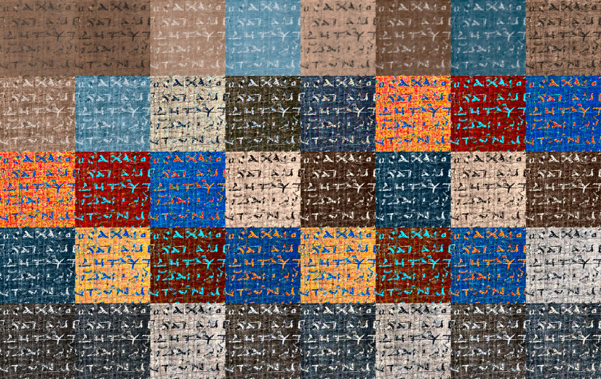

# Hierax

The purpose of this software is to enhance the legibility of papyri for text edition and publication. It consists of an image processing tool and an image viewer.

## HIGHLIGHTS

— **Fully automatic image enhancement**, which is especially useful for processing image collections.

— **Multiple enhancement methods**, for covering a variety of document and reproduction qualities, tasks, and subjective preferences.

— **Complementary to other software**, such as DStretch and Photoshop.

## CONTENTS

* **app**: Matlab (R2020b) app
* **code**: Matlab (R2020b) source code
* **help**: documentation (see also [hierax.ch](https://hierax.ch))
* **images**: smaple papyri images

* **article**: technical background (Vlad Atanasiu, Isabelle Marthot-Santaniello (2022), “Legibility Enhancement of Papyri Using Color Processing and Visual Illusions: A Case Study in Critical Vision”, International Journal on Document Analysis and Recognition (IJDAR), 25: 129–160, https://doi.org/10.1007/s10032-021-00386-0)

